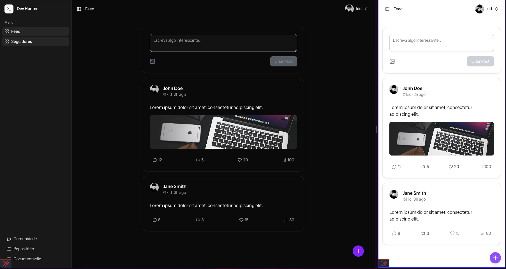
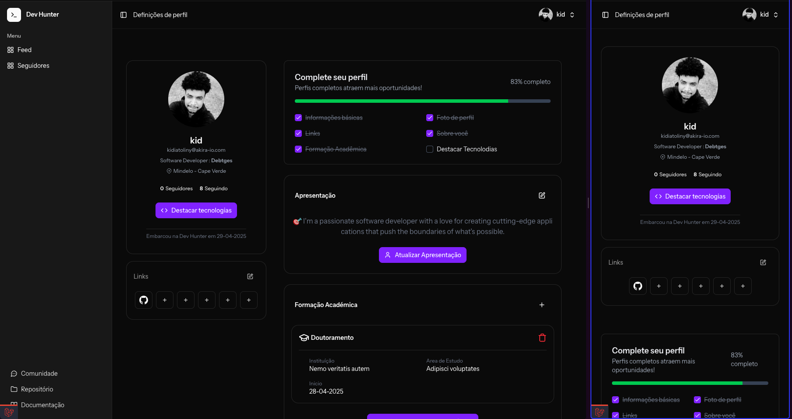

# Dev Hunter

**Dev Hunter** is a social network for developers to showcase their projects, share ideas, and connect with others in
the tech community. It's a platform built by developers, for developers, focusing on the human side of coding and
fostering collaboration and growth.






---

## 📜 Table of Contents

- [📖 Installation](#-installation)
- [🚀 Features](#-features)
- [💡 Problem](#-problem)
- [🔧 The Solution](#-the-solution)
- [🛠️ How It Works](#-how-it-works)
- [🎯 Why It’s Different](#-why-its-different)
- [🌍 Market Opportunity](#-market-opportunity)
- [🚧 Roadmap](#-roadmap)
- [📝 Contributing](#-contributing)
- [📬 Contact](#-contact)
- [⚙️ Technologies](#-technologies)
- [🤝 License](#-license)

---

## 📖 Installation

To get started with **Dev Hunter**, follow these steps:

1. Clone the repository:
   ```bash
    git clone https://github.com/akira-io/devhunter.git
    cd devhunter
    ```
2. Install dependencies:
   ```bash
    composer install
    npm install
    ```
3. Set up your environment and run database migrations:
    ```bash
     cp .env.example .env
     php artisan key:generate
     php artisan migrate
     ```

If you're not using SQLite, you may need to adjust the database connection settings in your `.env` file.

> **Note:** If you're using a different database, ensure your `.env` file is correctly configured with the appropriate
> database driver, credentials, and environment settings.

4. Start the development server:
   ```bash
    php artisan serve
    npm run dev
    ```

### Using Laravel Herd

If you're using [Laravel Herd](https://laravel.com/docs/10.x/herd), follow the official documentation to configure your
local development environment.

### Using Docker

If you prefer Docker, you can use Laravel Sail to set up the project environment. Refer to
the [Laravel Sail documentation](https://laravel.com/docs/10.x/sail) for step-by-step instructions.

## 🚀 Features

- **Developer Profiles**: Create your profile with tech stack, bio, and achievements.
- **Project Showcase**: Share your coding projects, highlight your best work.
- **Devlogs & Posts**: Post ideas, reflections, devlogs, and share your learning experiences.
- **Interactive HuntLine**: Like, comment, and follow other devs for engagement and collaboration.
- **Explore by Stack**: Discover projects based on programming language, framework, and more.
- **Community First**: A 100% developer-focused community, without algorithms hiding your content.

---

## 💡 Problem

Current platforms don’t fully value the developer as a creator:

- Portfolios are often static and lack personality.
- GitHub, while technical, is impersonal.
- There is little space for devs to share ideas, thoughts, and reflections.
- Communities are often fragmented, making it hard to build relationships and grow.

---

## 🔧 The Solution

**Dev Hunter** offers a platform where developers can:

- Create detailed profiles and showcase their skills and achievements.
- Share devlogs, thoughts, and project updates in a meaningful way.
- Engage with a like-minded community, collaborate, and grow together.
- Explore other developers’ projects by their tech stack and interests.

---

## 🛠️ How It Works

1. **Create Your Profile**: Add your tech stack, bio, and showcase your best work.
2. **Post and Share**: Write quick posts or long devlogs to share your experiences and ideas.
3. **Interactive HuntLine**: Engage with others through likes, comments, and follow developers.
4. **Explore by Stack**: Filter projects by programming language, framework, or tool.

---

## 🎯 Why It’s Different

- **Developer-Centered**: A platform 100% focused on developers.
- **No Algorithms**: Your content is displayed to the community without hidden algorithms or content restrictions.
- **Dev-Friendly Interface**: A clean, dark-mode interface designed for ease of use.
- **Human Focused**: We emphasize the human side of coding—your thoughts, your journey, your story.

---

## 🌍 Market Opportunity

There are millions of developers worldwide who want to be seen, heard, and valued:

- A growing audience of indie devs, freelancers, and content creators.
- A trend toward niche, authentic communities over generic platforms.
- Open source, SaaS, and tech content are more popular than ever.

---

## 🚧 Roadmap

### Next Steps:

- MVP with user authentication, posts, and following.
- Beta testing with the developer community.
- Organic growth via content creators.
- Ethical and transparent monetization planning.

---

## 📝 Contributing

We welcome contributions to **Dev Hunter**! To get started:

1. Fork the repository.
2. Create a new branch (`git checkout -b feature-name`).
3. Commit your changes (`git commit -am 'Add new feature'`).
4. Push to the branch (`git push origin feature-name`).
5. Create a new Pull Request.

---

## 📬 Contact

Want to get involved, support the project, or learn more?

- Email us at: geral@akira-io.com
- Join our community: [Dicord](https://discord.gg/ghPqZg3RcZ)

Let’s build this community together!

---

## ⚙️ Technologies

- **Frontend**: React
- **Backend**: Laravel
- **Database**: [Sqlite, Postgres.]
- **Authentication**: Laravel Auth
- **Hosting**: [Digital Ocean, AWS]

---

## 🤝 License

This project is licensed under the **[GNU Affero General Public License](LICENSE.md)**
